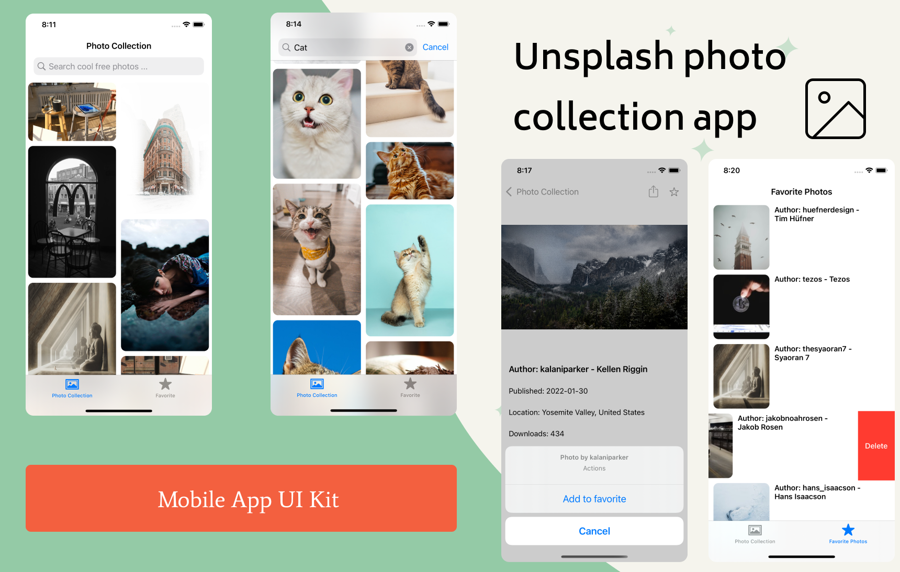

# Unsplash Image Collection App

### 🔷 General
- This app was a test task on ios developer pos. There is tech_task.pdf file, where given all requirements. 

  
  &nbsp;&nbsp;&nbsp;&nbsp;&nbsp;&nbsp;&nbsp;&nbsp;&nbsp;&nbsp;&nbsp;&nbsp;&nbsp;&nbsp;&nbsp;&nbsp;&nbsp;&nbsp;&nbsp;&nbsp;&nbsp;&nbsp;&nbsp;
  
&nbsp; &nbsp; &nbsp; &nbsp;

### 🔷 Functionality
- A list of popular photos on home page
- Searching images by keywords
- Saving image to favorites
- Deleting from favorites
- Observing additional info about particular image
- Sharing friends unsplash link of particular image

  

### 🔷 Architecture
- Coordinator + MVC

### 🔷 Used Tools
- UserDefaults for saving image to favorites
- NotificationCenter for updating favorites info
- Pods for connecting lib for pinterest-style layout
- URLSession for networking service
